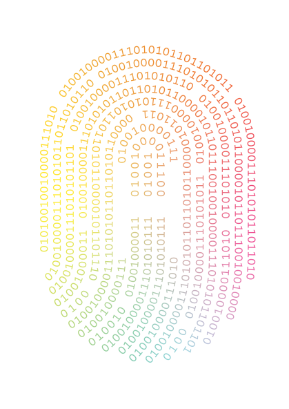

<div align="center">



# HUMAN.AI

**Talent Intelligence Platform** — your company's AI memory of every candidate it has ever met.


</div>

Recruiters re-source candidates they already know. HUMAN.AI ingests resumes and recruiter notes, turns them into a knowledge graph with full provenance, and answers natural-language queries with a ranked, **explainable** shortlist — every claim traceable to its source document.

```
resume / notes ──▶ parser ──▶ LLM extractor ──▶ knowledge graph (Neo4j ⇄ Qdrant)
                                                        │
recruiter's question ──▶ hybrid search ──▶ shortlist with cited evidence
```

The core idea is **KAG (Knowledge-Augmented Generation)**: the graph is the source of truth, the vector index only finds — every answer is grounded in graph facts, not embeddings. No hallucinated candidates.

## Stack

Python 3.11 · FastAPI · Pydantic v2 · Neo4j 5 · Qdrant · Celery + Redis · BGE-M3 (local embeddings) · LLM via OpenRouter · Docker Compose

## Quickstart

```bash
cp .env.example .env          # set NEO4J_PASSWORD (and OPENROUTER_API_KEY for the extractor)
docker compose up -d          # Neo4j + Qdrant + Redis + API
curl localhost:8000/health    # {"status":"ok"}
```

Local dev: `pip install -e ".[dev]"` → `uvicorn api.main:app --reload` → `pytest` (infra-dependent tests skip automatically).

## Roadmap

| Milestone | Scope | Status |
|---|---|---|
| v1.0 | Infrastructure, graph ontology, migrations | ✅ done |
| v1.1 | Ingestion pipeline: PDF → parse → extract → graph | 🔨 in progress |
| v1.2 | Entity resolution, ATS connector, vector layer | planned |
| v1.3 | KAG retrieval: natural-language search with citations | planned |

---

<div align="center">
<sub>A <b>HUMAN.AI</b> startup project · pre-MVP · built in the open</sub>
</div>
